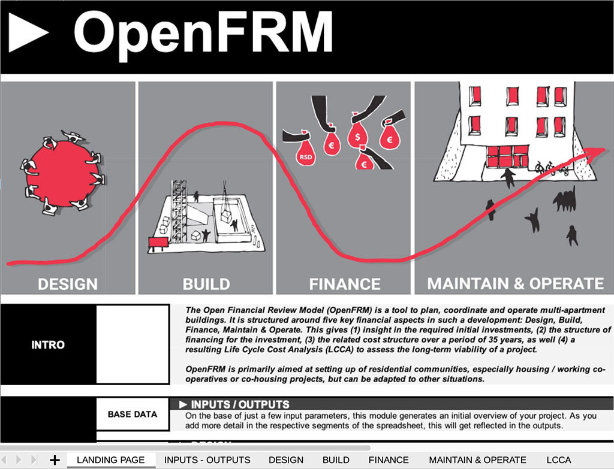
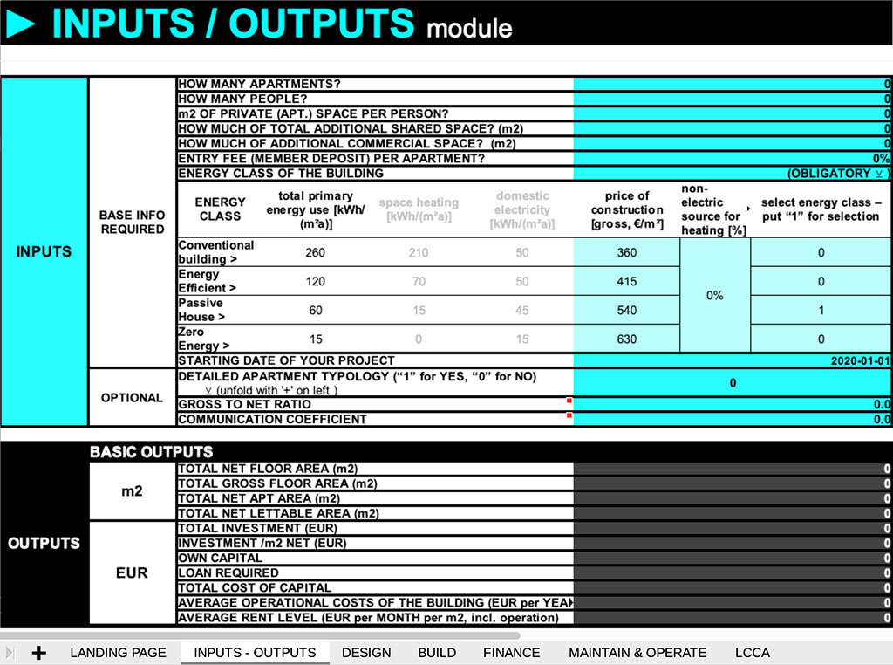
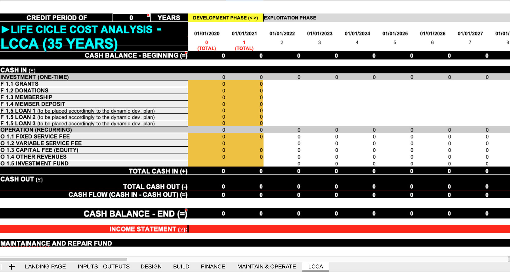

# OpenFRM
A powerful costs-calculation and life-cycle costs analysis (LCCA) tool – for developing, maintaining and operating multi-apartment buildings. It is primarily aimed at groups and communities that want to take the development of their future housing environment into their own hands (but is not limited to this).

## what this tool does

OpenFRM gives insight in the anticipated financial flows during the process of developing your building and throughout a 35-years period of running it. You can easily adapt it to meet the requirements of your own project. OpenFRM takes into account all costs of constructing, financing, owning and operating the building.

• initial costs (starting up, design, acquisition / construction)

• finance charges (loan interest payments etc.)

• costs of operation, utilities (energy etc.) and maintenance

The result is a collection of sheets ("modules") detailing the different categories of costs, their chronological ordering as well as their implications during the lifespan of the building. As a result, it demonstrates  the costs of living for the period of 35 years for the different unit types proposed.

## why this is relevant

Initiating, constructing and operating a multi-apartment building is a daunting task. Not only due to the wealth of issues to be taken into account, but equally because envisioning and testing different scenarios is a highly complex endeavour. However, **it is exactly with this "design" of parameters that a group of residents gains the power over their future housing reality.** Thus, OpenFRM has come to life to aid this ambition.

## how OpenFRM is installed

The tool can be downloaded directly from the GitHub repository, or as a zip package (including additional documentation) from the [MOBA.coop](http://www.moba.coop) website. It comes in the form of an .ods file (OpenDocument Spreadsheet file).

You can open the .ods file with LibreOffice or any compatible tool.

## the modules of the OpenFRM spreadsheet

OpenFRM is built around a spreadsheet. When you open the file, you arrive at the landing page. In the menu bar in the bottom you will apart from the Landing Page find 6 different tabs (“modules”): Inputs / Outputs, Design, Build, Finance, Maintain & Operate and finally the Life Cycle Cost Analysis (LCCA). By clicking the different tabs, you can navigate through the modules.

With the Design and Build module you get an overview of the actual investment into the project, with Finance the structure and cost of capital, while Maintain & Operate brings you to the logic of keeping the building up & running on the long-term. The LCCA module shows the cash-flow, financial performance and viability of your project over the long term.

## getting started with your project

Navigating to the Inputs/Outputs module, you can enter the date of your project. Important is to understand that you can use OpenFRM as a tool to design your project, or review different scenarios for it – not just to “validate” a well worked-out proposal. This means that with providing just a few parameters you will already be returned some basic insights in your project.

In the Inputs/Outputs module you start in the top (“inputs”) by indicating the scale of your multi-apartment building (m2, number of people, apartment size, etc.), indicate the deposit each of the households will provide (entry fee, this can be 0) and you choose the energy class of the building. If you have detailed information available about the typology of the building (different apartment sizes, etc.) you use and expand the “detailed apartment typology” section. Make sure to provide you inputs in the fields marked blue.

Navigating to the middle section (“outputs”), you will find the first results of the project you have provided. It will tell you what is the size of the investment, the basic structure of the capital required and will provide a break-down of the investment structure and operational costs.

Finally, near the bottom of this section of the Inputs/Outputs module, you will find a number of additional outputs that will be generated if you have chosen to provide the detailed apartment typology.

What is important to note is that in this stage, much of the outputs are still generated using standard (“default”) parameters. The more realistic detail you will provide throughout the following 4 key sections (design, build, finance, maintain & operate), the more realistic the generated outputs will become. However, for a quick assessment, the default values may provide a good start.

## the color coding of the fields (blue / black)

Each of the 6 modules has fields that are marked in blue (your input required), black (output automatically generated by the tool, no input required) or yellow (summary, no input required). In short: the fields marked in blue will need your input. Be cautious when changing the data in the black sections, as the links inside the spreadsheet will “break” and the tool stops working correctly. (If you are confident with modifying the spreadsheet, be free to do so!)

## expanding data fields

Inside the 6 modules you will find that parts of the sheet may be summarized. In that case, a “+” sign will indicate that detailed information is available but has been collapsed. To expand such a collapsed part of a section, simply click the “+” sign.

## Life Cycle Cost Analysis (LCCA)

Next, it may be interesting to move to the LCCA module (use the bottom tab). There you will find a multi-year summary of the performance of your project. While the level of detail here at first might seem intimidating, you quite quickly can start understanding the relation between certain choices you make regarding the setup of your project, and the financial impact they have. This is of course also crucial to review if a project will perform well for the group of residents that will be using it!

## What data do you need to prepare for a useful assessment?

If you want to step beyond the first try-out of your project, you can enter more realistic data about it. The categories in this form (“prep list”) provide a good start. They are organised per module. Not all modules are crucial at this stage to get an estimate - you can add more detail later. 

## contributing to OpenFRM

OpenFRM is developed and maintained on the platform GitHub. If you have suggestions, improvements or new functionality to add to OpenFRM, you can submit them there. The stable release can be found in the "master" branch, while testing & development takes place in the "beta" branch.

## how to get help

OpenFRM is provided as-is. The wiki provides a more detailed manual.

You can open issues on GitHub. If you need to contact the coordinators for other reasons, use: openfrm@moba.coop

## initial development

OpenFRM has been initiated by [STEALTH.unlimited](www.stealth.ultd.net) and the team of [Ko Gradi Grad (Who Builds the City, Belgrade)](https://www.kogradigrad.org/), and collectively tested and reviewed within the [MOBA network](https://www.moba.coop/). [Creative Industries Fund NL](https://stimuleringsfonds.nl/en/) has provided funding to develop it as a tool for the wider community of emerging housing initiatives and co-operatives. It is open source, provided 'as-is', and you can tweak it to fit your purpose.

CC-BY-SA 4.0

